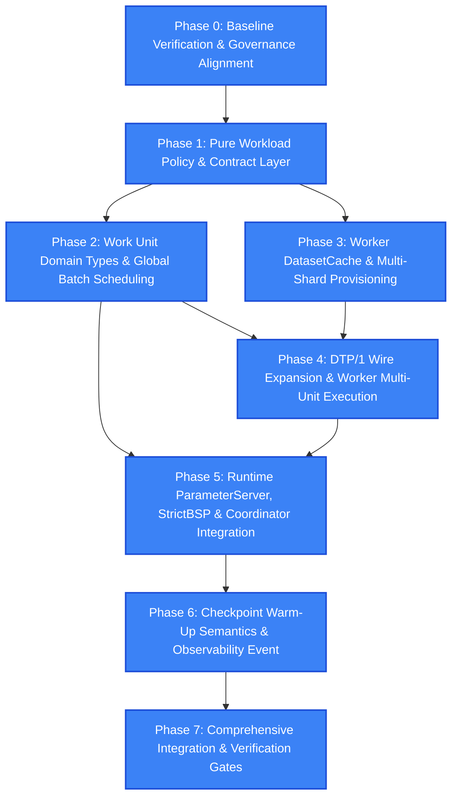

# Execution Blueprint: Dynamic Batch Size (DBS) & Work Unit Implementation

> **Skill Applied**: `implementation-planner`  
> **Target Subsystems**: `src/pbl4/runtime/`, `src/pbl4/worker/`, `src/pbl4/protocol/`, `src/pbl4/management_backend/`  
> **Status**: APPROVED EXECUTION BLUEPRINT (Pre-Implementation Baseline)

---

## 1. Source Snapshot

| Attribute | Value / Reference |
| :--- | :--- |
| **Approved Plan Source** | [docs/DBS_IMPLEMENTATION_PLAN.md.md](file:///d:/HKI%2026-27/PBL4/demo/docs/DBS_IMPLEMENTATION_PLAN.md.md) |
| **Governing Canonical Design** | [docs/DBS_DESIGN.md](file:///d:/HKI%2026-27/PBL4/demo/docs/DBS_DESIGN.md) (Normative specification for Work Unit & DBS algorithm) |
| **Governing Architecture & Contract** | [AGENTS.md](file:///d:/HKI%2026-27/PBL4/demo/AGENTS.md) (Normative Rules 1–17, esp. Rule 17: *DBS is workload scheduling under StrictBSP*), [docs/IMPLEMENTATION_CONTRACT.md](file:///d:/HKI%2026-27/PBL4/demo/docs/IMPLEMENTATION_CONTRACT.md) |
| **Current Repository Branch** | `feature/dynamic-batch-size-algorithm` |
| **Current HEAD Commit** | `197cb478468d88d7f40365d79ce70d402d53d2f5` (`chore: update agent system for Node Agent and DBS architecture`) |
| **Plan Audit Commit** | `50796b2afe5c3ea46e05a038df27d4da9b09c468` (`fix(management_backend): keep runtime snapshots during DB outage and document DTP/MCP host config`) |
| **Anchor Reachability** | `REACHABLE` (`git merge-base --is-ancestor 50796b2 HEAD` returned 0) |
| **Scoped Diff (Anchor -> HEAD)** | PR #6 (API review), PR #7 (Full system smoke & contract alignment), and Node Agent / DBS rule codification. Protocol added `Error` message; `ParameterServer` added error dispatch & `last_seen`; `contract_resolver.py` preserved preprocessing. |
| **Unavailable Sources / Tools** | `NONE` (Python 3.12 venv, pytest, ruff, architecture checker all verified functional). |

---

## 2. Frozen Decisions

1. **StrictBSP Remains Synchronization Strategy**:
   - `training_strategy` remains `"strict_bsp"` exclusively.
   - Do NOT introduce `dbs_bsp`, `DbsStrictBSP`, or custom synchronization strategies.
   - Worker membership is fixed ($N$ workers). Barrier requires full $N/N$ gradient contributions and full $N/N$ `PARAMETER_APPLIED` acknowledgments.
   - *Source*: [AGENTS.md#Rule-17](file:///d:/HKI%2026-27/PBL4/demo/AGENTS.md), [docs/DBS_DESIGN.md §4](file:///d:/HKI%2026-27/PBL4/demo/docs/DBS_DESIGN.md#L54-L87).

2. **DBS is Runtime-Owned Workload Scheduling**:
   - DBS policy (`"equal" | "dbs"`) lives in Runtime memory only and determines *how many* Work Units worker $i$ processes ($k_i$) for a step.
   - The global Work Unit set for step $s$ (size $K$) is identical regardless of whether policy is `"equal"` or `"dbs"`.
   - Node Agent, Management Backend, and Database are NEVER in the training critical path.
   - *Source*: [AGENTS.md#Rule-4](file:///d:/HKI%2026-27/PBL4/demo/AGENTS.md), [AGENTS.md#Rule-17](file:///d:/HKI%2026-27/PBL4/demo/AGENTS.md), [docs/DBS_DESIGN.md §3, §8](file:///d:/HKI%2026-27/PBL4/demo/docs/DBS_DESIGN.md#L30-L53).

3. **Single Logical Contribution Per Worker**:
   - Each worker processes $k_i$ Work Units sequentially, averages gradients locally weighted by unit sample counts:
     $$g_{\text{local}} = \frac{\sum_u n_u g_u}{\sum_u n_u}$$
   - The worker sends exactly **one** logical gradient contribution with `sample_count` $= \sum_u n_u$.
   - Global aggregation remains sample-weighted:
     $$g_{\text{global}} = \frac{\sum_i n_i g_{\text{local}, i}}{\sum_i n_i}$$
   - *Source*: [docs/DBS_DESIGN.md §9](file:///d:/HKI%2026-27/PBL4/demo/docs/DBS_DESIGN.md#L230-L253).

4. **Zero Protocol Version Bump (DTP/1 Retained)**:
   - DTP version remains 1 (`protocol_version = 1`), 48-byte binary framing unchanged, message catalogue unchanged.
   - `DatasetAssignment`: optional `cache_scope: str = "assigned_shard" | "all_shards"` (defaults to `"assigned_shard"` for backward compatibility; Work Unit mode sends `"all_shards"`).
   - `ShardReady`: NO field additions. Under `cache_scope="all_shards"`, sent only after all shards are cached and verified.
   - `StepStart`: optional `work_units: list[dict]` added. Existing `shard_id`, `batch_id` populated with the first Work Unit for logging/backward compatibility.
   - `GradientMeta`: `compute_ms: float > 0` must be populated with measured compute time.
   - *Source*: [AGENTS.md#Rule-3](file:///d:/HKI%2026-27/PBL4/demo/AGENTS.md), [docs/DBS_DESIGN.md §10](file:///d:/HKI%2026-27/PBL4/demo/docs/DBS_DESIGN.md#L254-L285).

5. **No State Machine Extensions & No DB Schema Changes**:
   - Coordinator states: `CREATED -> WAITING_WORKERS -> PROVISIONING -> INITIALIZING -> RUNNING -> COMPLETING -> COMPLETED`.
   - WorkerSession states: `CONNECTING -> REGISTERING -> PROVISIONING -> SHARD_READY -> MODEL_SYNCING -> READY`.
   - Step states: `COLLECTING_GRADIENTS -> AGGREGATING -> UPDATING -> WAITING_PARAMETER_APPLIED -> CHECKPOINTING -> COMMITTED`.
   - No DB tables or new DB columns for DBS metrics.
   - *Source*: [docs/DBS_DESIGN.md §4.1, §14](file:///d:/HKI%2026-27/PBL4/demo/docs/DBS_DESIGN.md#L68-L74).

6. **Checkpoint V1 Preserved (No Checkpoint V2)**:
   - Checkpoint V1 schema remains unchanged (`RecoveryCursor(epoch, next_batch_ordinal)`).
   - Transient DBS metrics ($p_i$, cumulative `compute_ms`) are NOT persisted to checkpoint.
   - Resume rule:
     - Boundary resume (`next_batch_ordinal == 0`): current epoch runs `"equal"` and collects stats; subsequent epoch runs `"dbs"`.
     - Mid-epoch resume (`next_batch_ordinal > 0`): remainder of current epoch runs `"equal"` (no stats collection); next full epoch runs `"equal"` and collects stats; subsequent epoch runs `"dbs"`.
   - *Source*: [docs/DBS_DESIGN.md §12](file:///d:/HKI%2026-27/PBL4/demo/docs/DBS_DESIGN.md#L310-L332).

7. **Paper Algorithm Rigor (arXiv:2007.11831)**:
   - $d_i^j = \frac{\text{samples}_i^j}{\text{total\_samples}^j}$
   - $p_i^j = \frac{d_i^j}{t_i^j}$ where $t_i^j = \sum \text{compute\_ms}$ across committed steps in epoch $j$.
   - $r_i = \frac{p_i}{\sum p_i}$, ideal batch allocation $q_i = r_i \times K$.
   - Integer projection: initial $k_i = 1$; remaining $K - N$ units assigned greedily to minimize $\sum (k_i - q_i)^2$; tie-break by smaller `worker_id`.
   - Golden test: $K=64, N=4$, ideal $[13.7, 16.5, 19.6, 14.2] \to [14, 16, 20, 14]$.
   - *Source*: [docs/DBS_DESIGN.md §7](file:///d:/HKI%2026-27/PBL4/demo/docs/DBS_DESIGN.md#L137-L211).

---

## 3. Codebase Drift Analysis

Comparison between Audit Anchor (`50796b2`) and current HEAD (`197cb47`):

| File / Component Path | Status Classification | Drift Details & Adaptation Strategy |
| :--- | :--- | :--- |
| `src/pbl4/management_backend/schemas/job.py` | `COMPATIBLE` | Schemas ready for `workload_policy` and `work_units_per_step` in `RequestedContractV1` / `ResolvedContractV1`. |
| `src/pbl4/management_backend/services/contract_resolver.py` | `IMPLEMENTATION_CHANGED_SEMANTICS_SAME` | Preprocessing preservation added in PR #7. Workload section resolution fits cleanly without disturbing preprocessing logic. |
| `src/pbl4/protocol/messages.py` | `IMPLEMENTATION_CHANGED_SEMANTICS_SAME` | `Error` message added in HEAD. `DatasetAssignment`, `StepStart`, and `GradientMeta` extend seamlessly. |
| `src/pbl4/runtime/parameter_server.py` | `IMPLEMENTATION_CHANGED_SEMANTICS_SAME` | Added `_error_handler` and `last_seen` in HEAD. `_to_contribution()` and `send_step_start()` can be cleanly updated to wire `compute_ms` and `work_units`. |
| `src/pbl4/worker/worker_client.py` | `IMPLEMENTATION_CHANGED_SEMANTICS_SAME` | Added `send_error()` in HEAD. `send_gradient()` signature can safely accept `compute_ms: float = 0.0`. |
| `src/pbl4/runtime/batch_scheduler.py` | `COMPATIBLE` | Old assumption ($N$ workers, identical batch IDs per shard) must be replaced with global `WorkUnitRef` catalog and $K$-unit partitioning. |
| `src/pbl4/runtime/synchronization/strict_bsp.py` | `COMPATIBLE` | Invariant checks for $N/N$ remain untouched; contribution admission validation adapts to match `BatchAssignment` with `work_units`. |
| `src/pbl4/runtime/coordinator.py` | `COMPATIBLE` | Lifecycle progression unchanged. Integrate `WorkloadScheduler` at `open_step()` and committed step / epoch boundary gates. |
| `src/pbl4/runtime/process.py` | `COMPATIBLE` | Remove `worker_id = manifest["shard_id"]` 1-to-1 assumption. Fetch all manifests to build global catalog and initialize `BatchScheduler` + `WorkloadScheduler`. |
| `src/pbl4/worker/training_loop.py` | `COMPATIBLE` | Adapt to accept `DatasetCache` and execute sequential Work Unit computation with FP64 local gradient accumulation. |
| `src/pbl4/worker/process.py` | `COMPATIBLE` | Handle `cache_scope="all_shards"`, construct `DatasetCache`, measure `compute_ms` via `time.perf_counter()`. |
| `AGENTS.md` | `COMPATIBLE` | Rule 16 (Node Agent) and Rule 17 (DBS workload scheduling) already codified at HEAD. |

*Overall Drift Assessment*: **ZERO semantic conflicts.** All modifications are fully compatible with current HEAD.

---

## 4. Impact Map

```text
[Management Backend]
  RequestedContractV1 / Patch -> ADD workload_policy ("equal"|"dbs"), work_units_per_step (K)
  contract_resolver.py        -> RESOLVE ResolvedWorkload, enforce K >= N (equal) or K > N (dbs)
          │
          ▼
[DTP/1 Protocol Wire]
  DatasetAssignment           -> ADD optional cache_scope ("assigned_shard" | "all_shards")
  StepStart                   -> ADD optional work_units: list[dict]
  GradientMeta                -> ENFORCE compute_ms: float > 0
          │
          ├─────────────────────────────────────────────────┐
          ▼                                                 ▼
[Worker Node]                                     [Runtime Parameter Server]
  worker/dataset_cache.py (NEW)                     runtime/workload_policy.py (NEW)
    holds {shard_id: CachedShard}                     EqualWorkloadPolicy, DbsWorkloadPolicy
    loads WorkUnitRef(shard, batch, count)            project_units() (paper integer projection)
  worker/training_loop.py                           runtime/workload_scheduler.py (NEW)
    loops over work_units                             epoch WorkloadPlan, committed step tracking
    FP64 local accumulation                           epoch boundary transition & resume warm-up
  worker/process.py                                 runtime/synchronization/context.py
    caches all shards for "all_shards"                ADD WorkUnitRef, UPDATE BatchAssignment
    measures compute_ms via perf_counter()          runtime/batch_scheduler.py
  worker/worker_client.py                             global WorkUnit catalog, sha256 order
    transfers compute_ms in GradientMeta              assignments(cursor, plan) with drop_last
                                                    runtime/contribution.py
                                                      ADD compute_ms to Contribution
                                                    runtime/parameter_server.py
                                                      extracts compute_ms from GradientMeta
                                                    runtime/synchronization/strict_bsp.py
                                                      validates batch_ordinal & sample_count
                                                    runtime/coordinator.py
                                                      queries active plan, records on COMMITTED
                                                      advances epoch plan, emits telemetry
                                                    runtime/process.py
                                                      wires global catalog, all_shards scope
```

---

## 5. Phase DAG



---

## 6. Task Checklists

### Phase 0: Baseline Verification & Governance Alignment
- **Prerequisites**: Clean working tree on `feature/dynamic-batch-size-algorithm`.
- **Objective**: Verify that current codebase baseline passes all architecture and integration gates, and confirm no stale adaptive docs conflict with normative specs.

```text
TASK: T0.1
WHY: Establish verification baseline before touching any files.
SOURCE: docs/DBS_IMPLEMENTATION_PLAN.md.md §18 (Phase 0)
FILES/SYMBOLS: tests/, scripts/check_architecture.py
DEPENDS ON: None
EXPECTED CHANGE: Execute test suite and architecture check; confirm clean pass.
TEST: .venv/Scripts/pytest.exe tests/ -q; .venv/Scripts/python.exe scripts/check_architecture.py
DONE WHEN: 207+ tests pass, architecture check outputs PASSED.

TASK: T0.2
WHY: Ensure SynchronizationRegistry strictly accepts only "strict_bsp" and rejects any attempt to introduce "dbs_bsp".
SOURCE: docs/DBS_DESIGN.md §4, AGENTS.md Rule 17
FILES/SYMBOLS: tests/unit/test_synchronization_registry.py
DEPENDS ON: T0.1
EXPECTED CHANGE: Add explicit unit test asserting SynchronizationRegistry rejects "dbs_bsp" and only builds StrictBSP.
TEST: .venv/Scripts/pytest.exe tests/unit/test_synchronization_registry.py -q
DONE WHEN: Test passes, preventing regression on strategy immutability.
```

---

### Phase 1: Pure Workload Policy & Contract Layer
- **Prerequisites**: Phase 0 complete.
- **Objective**: Implement mathematical DBS paper formula, integer projection, and workload configuration in backend contracts without touching worker or network layers.

```text
TASK: T1.1
WHY: Pure mathematical implementation of DBS formulation from arXiv:2007.11831 and integer error minimization projection.
SOURCE: docs/DBS_DESIGN.md §7, docs/DBS_IMPLEMENTATION_PLAN.md.md §5
FILES/SYMBOLS: src/pbl4/runtime/workload_policy.py (NEW)
DEPENDS ON: T0.2
EXPECTED CHANGE: Implement WorkerEpochStats, WorkloadPlan, project_units(), EqualWorkloadPolicy, and DbsWorkloadPolicy with zero external imports (no torch, no db, no network).
TEST: tests/unit/test_workload_policy.py
DONE WHEN: Fully tested: golden test [13.7, 16.5, 19.6, 14.2] -> [14, 16, 20, 14], extreme skew (k_i >= 1 preserved), deterministic tie-breaking, invalid stats rejection.

TASK: T1.2
WHY: Expand job contracts to declare workload policy ("equal" | "dbs") and work_units_per_step (K).
SOURCE: docs/DBS_DESIGN.md §11, docs/DBS_IMPLEMENTATION_PLAN.md.md §3
FILES/SYMBOLS: src/pbl4/management_backend/schemas/job.py, src/pbl4/management_backend/services/contract_resolver.py
DEPENDS ON: T1.1
EXPECTED CHANGE: Add workload_policy and work_units_per_step to RequestedContractV1/Patch. Add ResolvedWorkload to ResolvedContractV1. Resolver enforces K >= N (equal) and K > N (dbs).
TEST: tests/unit/test_contract_workload.py, src/pbl4/management_backend/tests/test_contracts.py
DONE WHEN: Valid requests resolve correctly; invalid configurations (e.g. K <= N for DBS, K < N for Equal, non-integer types) are rejected with clear 400 errors.
```

---

### Phase 2: Work Unit Domain Types & Global Batch Scheduling
- **Prerequisites**: Phase 1 complete.
- **Objective**: Define immutable WorkUnitRef, update BatchAssignment to support multi-unit assignments, and implement global Work Unit batch scheduling with drop_last.

```text
TASK: T2.1
WHY: Introduce immutable WorkUnitRef and evolve BatchAssignment to represent multiple units per step per worker.
SOURCE: docs/DBS_DESIGN.md §5.1, docs/DBS_IMPLEMENTATION_PLAN.md.md §4
FILES/SYMBOLS: src/pbl4/runtime/synchronization/context.py
DEPENDS ON: T1.2
EXPECTED CHANGE: Add WorkUnitRef(shard_id, batch_id, sample_count). Update BatchAssignment(worker_id, batch_ordinal, work_units, sample_count). Provide backward-compatible shard_id/batch_id properties.
TEST: tests/unit/test_synchronization_context.py
DONE WHEN: WorkUnitRef and BatchAssignment validate immutability, positive sample_count, non-empty work_units, and distinct (shard_id, batch_id) pairs.

TASK: T2.2
WHY: Replace per-worker shard partition assumption with global Work Unit catalog ordering and deterministic $K$-unit assignment.
SOURCE: docs/DBS_DESIGN.md §8, docs/DBS_IMPLEMENTATION_PLAN.md.md §7
FILES/SYMBOLS: src/pbl4/runtime/batch_scheduler.py
DEPENDS ON: T2.1
EXPECTED CHANGE: BatchScheduler accepts global tuple[WorkUnitRef], seed, epochs, K. Orders catalog via sha256([seed, epoch, shard_id, batch_id]). Computes steps_per_epoch = floor(M / K). assignments(cursor, plan) slices K units and partitions by plan.units_per_worker.
TEST: tests/unit/test_batch_scheduler.py, tests/test_runtime_membership_schedule.py
DONE WHEN: Tests pass: equal and dbs select identical global K units at same cursor; remainder M mod K dropped cleanly; cursor recovery verified.
```

---

### Phase 3: Worker DatasetCache & Multi-Shard Provisioning
- **Prerequisites**: Phase 1 complete, T2.1 complete.
- **Objective**: Implement DatasetCache to manage multiple CachedShard instances, and enable workers to download and verify all shards during provisioning when cache_scope="all_shards".

```text
TASK: T3.1
WHY: Provide a thread-safe multi-shard container for workers to access any WorkUnitRef.
SOURCE: docs/DBS_DESIGN.md §6, docs/DBS_IMPLEMENTATION_PLAN.md.md §8.2
FILES/SYMBOLS: src/pbl4/worker/dataset_cache.py (NEW)
DEPENDS ON: T2.1
EXPECTED CHANGE: Create DatasetCache holding dict[int, CachedShard]. Implement load_work_unit(unit: WorkUnitRef), verify_all(), eligible_work_unit_count.
TEST: tests/unit/test_dataset_cache.py
DONE WHEN: Loading valid WorkUnitRef returns correct (x, y, sample_ids) with length == unit.sample_count; unknown shard or batch raises KeyError/ValueError.

TASK: T3.2
WHY: Allow worker to provision all dataset shards on demand when instructed by Runtime.
SOURCE: docs/DBS_DESIGN.md §6, docs/DBS_IMPLEMENTATION_PLAN.md.md §8.3
FILES/SYMBOLS: src/pbl4/protocol/messages.py, src/pbl4/worker/process.py
DEPENDS ON: T3.1
EXPECTED CHANGE: Add optional cache_scope: str = "assigned_shard" to DatasetAssignment. In worker/process.py, if cache_scope == "all_shards", iterate all shard references in root manifest, download and verify each via ShardDownloader + ShardCache, and instantiate DatasetCache before sending SHARD_READY.
TEST: tests/unit/test_worker_dataset_provisioning.py
DONE WHEN: Worker successfully provisions and caches all shards under cache_scope="all_shards"; sends standard SHARD_READY only after 100% verification.
```

---

### Phase 4: DTP/1 Wire Expansion & Worker Multi-Unit Execution
- **Prerequisites**: Phase 2 and Phase 3 complete.
- **Objective**: Extend StepStart and GradientMeta wire payloads, update TrainingLoop to compute multiple Work Units with FP64 local gradient accumulation, and capture accurate compute_ms.

```text
TASK: T4.1
WHY: Expand StepStart message to carry assigned work_units and GradientMeta to carry compute_ms.
SOURCE: docs/DBS_DESIGN.md §10, docs/DBS_IMPLEMENTATION_PLAN.md.md §9
FILES/SYMBOLS: src/pbl4/protocol/messages.py
DEPENDS ON: T2.2, T3.2
EXPECTED CHANGE: Add optional work_units: list[dict] to StepStart; validate non-empty, sum(sample_count) == expected_sample_count. Validate GradientMeta.compute_ms > 0 in Work Unit mode.
TEST: tests/unit/test_dtp_messages.py
DONE WHEN: Serialization and deserialization roundtrip perfectly; invalid payloads rejected.

TASK: T4.2
WHY: Support processing multiple Work Units in a single step and aggregating local gradients by sample weight.
SOURCE: docs/DBS_DESIGN.md §9, docs/DBS_IMPLEMENTATION_PLAN.md.md §10
FILES/SYMBOLS: src/pbl4/worker/training_loop.py
DEPENDS ON: T4.1
EXPECTED CHANGE: StepAssignment holds work_units tuple. TrainingLoop.compute() iterates over work_units, loads data from DatasetCache, invokes adapter.compute_loss_and_gradients(), accumulates gradients in FP64: sum(n_u * g_u) / sum(n_u), casts to FP32, returns single LocalGradient with total sample_count.
TEST: tests/unit/test_training_loop_multi_unit.py
DONE WHEN: Unit test confirms: 1 unit equals standard behavior; multi-unit produces exact weighted average; parameter application unaffected.

TASK: T4.3
WHY: Accurately measure pure computation time (forward + backward + local accumulation) and transmit over DTP/1.
SOURCE: docs/DBS_DESIGN.md §7.2, §10, docs/DBS_IMPLEMENTATION_PLAN.md.md §11
FILES/SYMBOLS: src/pbl4/worker/process.py, src/pbl4/worker/worker_client.py
DEPENDS ON: T4.2
EXPECTED CHANGE: In worker/process.py, wrap loop.compute() with time.perf_counter() to compute compute_ms = (t_end - t_start) * 1000. Pass compute_ms into worker_client.send_gradient().
TEST: tests/unit/test_worker_compute_timing.py
DONE WHEN: compute_ms strictly reflects compute duration (excluding network transfer / barrier waits) and arrives in GradientMeta.
```

---

### Phase 5: Runtime ParameterServer, StrictBSP & Coordinator Integration
- **Prerequisites**: Phase 2 and Phase 4 complete.
- **Objective**: Integrate WorkloadScheduler, end-to-end compute_ms ingestion into Contribution, StrictBSP admission against BatchAssignment, and Coordinator epoch transitions.

```text
TASK: T5.1
WHY: Transfer compute_ms from incoming GradientMeta into Runtime Contribution dataclass.
SOURCE: docs/DBS_IMPLEMENTATION_PLAN.md.md §11
FILES/SYMBOLS: src/pbl4/runtime/contribution.py, src/pbl4/runtime/parameter_server.py
DEPENDS ON: T4.3
EXPECTED CHANGE: Add compute_ms: float to Contribution. In ParameterServer._to_contribution(), extract compute_ms from GradientMeta and populate Contribution.
TEST: tests/unit/test_parameter_server_contribution.py
DONE WHEN: Incoming gradient messages successfully construct Contribution with valid positive compute_ms.

TASK: T5.2
WHY: Validate incoming contributions against canonical multi-unit BatchAssignment in StrictBSP.
SOURCE: docs/DBS_DESIGN.md §4, §13, docs/DBS_IMPLEMENTATION_PLAN.md.md §12
FILES/SYMBOLS: src/pbl4/runtime/synchronization/strict_bsp.py
DEPENDS ON: T5.1
EXPECTED CHANGE: In StrictBSP admission check, verify contribution.batch_ordinal == assignment.batch_ordinal and contribution.sample_count == assignment.sample_count. Keep N/N barrier logic unchanged.
TEST: tests/unit/test_strict_bsp_work_units.py
DONE WHEN: Contributions matching canonical assignment admitted; mismatched sample_count or ordinal rejected.

TASK: T5.3
WHY: Manage in-memory WorkloadPlan, record committed step metrics, and transition plans at epoch boundaries.
SOURCE: docs/DBS_DESIGN.md §7, §12, docs/DBS_IMPLEMENTATION_PLAN.md.md §6
FILES/SYMBOLS: src/pbl4/runtime/workload_scheduler.py (NEW)
DEPENDS ON: T1.1, T5.1
EXPECTED CHANGE: Implement WorkloadScheduler to track active WorkloadPlan per epoch, collect metrics from COMMITTED contributions only, evaluate new plan at epoch completion, and reject invalid stats (e.g. compute_ms <= 0).
TEST: tests/unit/test_workload_scheduler.py
DONE WHEN: Correctly transitions from Equal in epoch 0 to DBS in epoch 1 based on actual committed statistics.

TASK: T5.4
WHY: Wire WorkloadScheduler, BatchScheduler, and ParameterServer in Coordinator and RuntimeProcess.
SOURCE: docs/DBS_DESIGN.md §4.2, §13, docs/DBS_IMPLEMENTATION_PLAN.md.md §13, §14
FILES/SYMBOLS: src/pbl4/runtime/coordinator.py, src/pbl4/runtime/process.py
DEPENDS ON: T5.2, T5.3
EXPECTED CHANGE: In RuntimeProcess, fetch all shard manifests to build global WorkUnit catalog, send cache_scope="all_shards" in DatasetAssignment, initialize WorkloadScheduler + BatchScheduler, pass active plan to open_step(), record stats on step COMMITTED, and transition epoch plans.
TEST: tests/integration/test_runtime_dbs_coordination.py
DONE WHEN: Coordinator smoothly runs multi-step training, opens steps with plan-based assignments, and updates model after N/N parameter ACK.
```

---

### Phase 6: Checkpoint Warm-Up Semantics & Observability Event
- **Prerequisites**: Phase 5 complete.
- **Objective**: Implement checkpoint resume warm-up logic without modifying Checkpoint V1 schema, and emit non-critical plan change telemetry.

```text
TASK: T6.1
WHY: Enforce the canonical resume rule: boundary resume uses Equal for 1 epoch before DBS; mid-epoch resume runs Equal without stats collection.
SOURCE: docs/DBS_DESIGN.md §12, docs/DBS_IMPLEMENTATION_PLAN.md.md §6, §16
FILES/SYMBOLS: src/pbl4/runtime/workload_scheduler.py, src/pbl4/runtime/coordinator.py
DEPENDS ON: T5.4
EXPECTED CHANGE: Implement WorkloadScheduler.reset_after_resume(cursor). If cursor.next_batch_ordinal == 0, current epoch is Equal with stats collection enabled. If cursor.next_batch_ordinal > 0, current epoch is Equal with stats collection disabled. Checkpoint schema remains strictly V1.
TEST: tests/integration/test_dbs_checkpoint_resume.py
DONE WHEN: Resuming at boundary or mid-epoch reproduces exact warm-up semantics without error or stats corruption.

TASK: T6.2
WHY: Emit observability event when WorkloadPlan changes at epoch boundary for benchmarking and UI visibility.
SOURCE: docs/DBS_DESIGN.md §15, docs/DBS_IMPLEMENTATION_PLAN.md.md §15
FILES/SYMBOLS: src/pbl4/runtime/coordinator.py
DEPENDS ON: T6.1
EXPECTED CHANGE: When active WorkloadPlan changes at epoch boundary, emit workload.plan_changed event with epoch, policy, units_per_worker, and target_ratios. Do not add DB tables or alter snapshot schema.
TEST: tests/unit/test_dbs_telemetry.py
DONE WHEN: Event is emitted on plan transition; failure to emit event does not break training loop.
```

---

### Phase 7: Comprehensive Integration & Verification Gates
- **Prerequisites**: Phase 0 through Phase 6 complete.
- **Objective**: Full end-to-end integration tests with heterogeneous worker speeds, verifying performance adaptation, strict mathematical correctness, and zero architecture violations.

```text
TASK: T7.1
WHY: End-to-end verification of DBS dynamic batch allocation with synthetic worker speed differences.
SOURCE: docs/DBS_DESIGN.md §2, §7, docs/DBS_IMPLEMENTATION_PLAN.md.md §18 (Phase 7)
FILES/SYMBOLS: tests/integration/test_dbs_heterogeneous_cluster.py (NEW)
DEPENDS ON: T6.2
EXPECTED CHANGE: Launch 3-worker cluster with synthetic compute delays (e.g. 10ms vs 20ms vs 40ms). Verify: epoch 0 runs Equal; epoch 1 shifts units to faster worker; N/N StrictBSP barrier holds; global model updates successfully.
TEST: .venv/Scripts/pytest.exe tests/integration/test_dbs_heterogeneous_cluster.py
DONE WHEN: Faster workers receive proportionally more Work Units; total K units per step remains invariant.

TASK: T7.2
WHY: Negative path testing: worker disconnect, cache corruption, invalid compute_ms, and insufficient units.
SOURCE: docs/DBS_DESIGN.md §13, docs/DBS_IMPLEMENTATION_PLAN.md.md §17
FILES/SYMBOLS: tests/integration/test_dbs_failure_semantics.py (NEW)
DEPENDS ON: T7.1
EXPECTED CHANGE: Verify that: worker disconnect fails attempt immediately; invalid compute_ms (<=0 or NaN) fails attempt at epoch boundary; cache miss after RUNNING fails attempt.
TEST: .venv/Scripts/pytest.exe tests/integration/test_dbs_failure_semantics.py
DONE WHEN: All failure paths trigger deterministic failure without hanging or silent fallbacks.

TASK: T7.3
WHY: Final pre-merge verification across architecture boundaries, code formatting, and full regression test suite.
SOURCE: docs/DBS_IMPLEMENTATION_PLAN.md.md §21 (Definition of Done)
FILES/SYMBOLS: scripts/check_architecture.py, src/, tests/
DEPENDS ON: T7.2
EXPECTED CHANGE: Run full test suite, architecture checker, and linter.
TEST: .venv/Scripts/pytest.exe tests/ -q; .venv/Scripts/python.exe scripts/check_architecture.py; .venv/Scripts/ruff.exe check src/ tests/
DONE WHEN: 100% tests pass, architecture check passes, ruff check passes with zero errors.
```

---

## 7. Derived Implementation Decisions

1. **Pure Formulation Isolation (`runtime/workload_policy.py`)**:
   - *Decision*: Place `WorkerEpochStats`, `WorkloadPlan`, and `project_units()` in a pure standalone module with zero imports from `torch`, `transport`, `protocol`, or `database`.
   - *Evidence*: `AGENTS.md` Rule 5 and Rule 6 mandate strict decoupling of training semantics and pure logic.
   - *Why implementation detail*: Packaging mathematical formulas into a clean helper module maintains standard Python architectural layering.
   - *Alternatives rejected*: Inlining DBS math into `coordinator.py` (rejected: creates massive coupling and hinders unit testing).

2. **DatasetCache as Composition over ShardCache (`worker/dataset_cache.py`)**:
   - *Decision*: Preserve `ShardCache` completely untouched for single-shard storage/verification, and introduce `DatasetCache` wrapping a dictionary of `{shard_id: CachedShard}`.
   - *Evidence*: `DBS_DESIGN.md §6` specifically directs: "ShardCache hiện có vẫn dùng để lưu/verify từng shard; thêm lớp DatasetCache để quản lý nhiều CachedShard."
   - *Why implementation detail*: Reuses existing verified downloading and verification mechanisms without modifying stable code.
   - *Alternatives rejected*: Rewriting `ShardCache` into a monolithic chunk cache (rejected: introduces significant risk of disk corruption and breaks existing tests).

3. **Double-Precision FP64 Local Gradient Accumulation**:
   - *Decision*: In `TrainingLoop.compute()`, accumulate multiple Work Unit gradients as $\sum n_u \cdot g_u$ using float64 tensors before dividing by $\sum n_u$ and casting back to float32.
   - *Evidence*: `docs/DBS_IMPLEMENTATION_PLAN.md.md §10` specifies: "total = sum(n_u * gradient_u) bằng FP64 accumulator; divide by total_sample_count; cast FP32".
   - *Why implementation detail*: Numerical precision optimization preventing floating point drift across multiple small batches.
   - *Alternatives rejected*: Accumulating in pure FP32 (rejected: prone to accumulation truncation errors when $K$ is large).

4. **Deriving Epoch Boundary in Coordinator**:
   - *Decision*: Determine epoch boundary transition directly when `next_cursor.epoch > operation.epoch` after checkpoint progression.
   - *Evidence*: `docs/DBS_IMPLEMENTATION_PLAN.md.md §7, §13` specifies that `RecoveryCursor` progression is already the canonical source of truth for step and epoch progression.
   - *Why implementation detail*: Eliminates the need for separate boolean flags or extra state variables.
   - *Alternatives rejected*: Adding custom epoch counter variables inside `Coordinator` (rejected: risks state desynchronization with `RecoveryCursor`).

5. **Migration Identity Preservation in Wire Messages**:
   - *Decision*: In `StepStart` and `GradientMeta`, set the compatibility fields `shard_id` and `batch_id` to the identity of `work_units[0]`.
   - *Evidence*: `docs/DBS_DESIGN.md §10` specifies that existing fields are retained for logging and wire compatibility during migration.
   - *Why implementation detail*: Allows existing monitoring, debug logs, and older test harnesses to inspect frames without crash.
   - *Alternatives rejected*: Omitting `shard_id` or setting to dummy -1 (rejected: breaks existing frame decoders and logging formatters).

---

## 8. Risks, Conflicts, and Explicit Non-Goals

### Risks & Mitigations
- **Risk 1: Worker OOM or High Latency with All-Shards Cache**:
  - *Mitigation*: In V1 demo scale, datasets are moderate in size. Shards are stored on disk in `ShardCache` and batches loaded on demand via memory mapping / file stream. No continuous memory blowup.
- **Risk 2: Floating Point Divergence in DBS Projection**:
  - *Mitigation*: `project_units()` strictly follows the objective function $\Delta_i = (k_i + 1 - q_i)^2 - (k_i - q_i)^2$ with explicit tie-breaking on smaller `worker_id`. Validated against golden test from paper Appendix A.
- **Risk 3: Deadlock on Disconnect During Multi-Unit Compute**:
  - *Mitigation*: Worker process liveness and heartbeat checks in `ParameterServer` remain active. If a worker disconnects, StrictBSP immediately marks the Attempt FAILED. No stall.

### Explicit Non-Goals (What We Will NOT Build)
- ❌ **No `dbs_bsp` or custom synchronization strategy**: `training_strategy` remains `strict_bsp`.
- ❌ **No DTP/2 protocol version**: DTP remains version 1 with 48-byte header.
- ❌ **No Checkpoint V2**: Checkpoint schema V1 is unchanged; DBS stats are transient.
- ❌ **No DB tables or migrations for DBS**: Metrics are kept in Runtime memory only.
- ❌ **No EMA smoothing, rebalance thresholds, or hardware profiling heuristics**.
- ❌ **No Dataset Manager calls during synchronized step training**.

---

## 9. Verification Matrix

| Verification Scope | Test File / Command | Target Invariant Verified |
| :--- | :--- | :--- |
| **Architecture Boundaries** | `.venv/Scripts/python.exe scripts/check_architecture.py` | Zero illegal package imports (protocol pure wire, transport pure socket, runtime decoupled). |
| **DBS Algorithm Math** | `tests/unit/test_workload_policy.py` | Paper Appendix A test ($[13.7, 16.5, 19.6, 14.2] \to [14, 16, 20, 14]$), $k_i \ge 1$, $\sum k_i = K$, tie-breaks. |
| **Contract Resolution** | `tests/unit/test_contract_workload.py` | Validates `workload_policy` ("equal"|"dbs"), $K \ge N$ (equal), $K > N$ (dbs). |
| **Global Batch Scheduler** | `tests/unit/test_batch_scheduler.py` | Deterministic ordering, identical global $K$ set between equal and dbs, $M \pmod K$ drop_last. |
| **DatasetCache Multi-Shard** | `tests/unit/test_dataset_cache.py` | Accesses batches across multiple shards, sample count verification, error handling. |
| **DTP/1 Wire Encoding** | `tests/unit/test_dtp_messages.py` | `StepStart` `work_units` array and `GradientMeta` `compute_ms` frame encoding/decoding. |
| **Worker Local Gradient** | `tests/unit/test_training_loop_multi_unit.py` | Correct sample-weighted FP64 mean gradient across multiple Work Units. |
| **StrictBSP & ParameterServer** | `tests/unit/test_strict_bsp_work_units.py` | Admission validation against multi-unit `BatchAssignment`, $N/N$ barrier unchanged. |
| **Resume Warm-Up** | `tests/integration/test_dbs_checkpoint_resume.py` | Boundary resume (1 epoch Equal + stats), mid-epoch resume (remainder Equal without stats). |
| **Heterogeneous Cluster** | `tests/integration/test_dbs_heterogeneous_cluster.py` | Real training run with 3 workers of varying speeds; faster workers receive larger unit share in epoch 1. |
| **System Regression** | `.venv/Scripts/pytest.exe tests/ -q` | All 207+ existing tests plus new tests pass cleanly. |

---

## 10. Completion Accounting

| Phase | Task ID | Description | Affected Files / Components | Status |
| :--- | :--- | :--- | :--- | :--- |
| **Phase 0** | `T0.1` | Run baseline tests & architecture check | `tests/`, `scripts/check_architecture.py` | `DONE` |
| **Phase 0** | `T0.2` | Verify StrictBSP immutability in registry | `tests/unit/test_synchronization_registry.py` | `DONE` |
| **Phase 1** | `T1.1` | Implement pure DBS math & integer projection | `src/pbl4/runtime/workload_policy.py`, `tests/unit/test_workload_policy.py` | `DONE` |
| **Phase 1** | `T1.2` | Expand job contract schemas & resolver | `schemas/job.py`, `services/contract_resolver.py` | `DONE` |
| **Phase 2** | `T2.1` | Implement WorkUnitRef & BatchAssignment | `src/pbl4/runtime/synchronization/context.py` | `DONE` |
| **Phase 2** | `T2.2` | Implement global Work Unit BatchScheduler | `src/pbl4/runtime/batch_scheduler.py` | `DONE` |
| **Phase 3** | `T3.1` | Implement worker DatasetCache | `src/pbl4/worker/dataset_cache.py` | `DONE` |
| **Phase 3** | `T3.2` | Worker multi-shard provisioning flow | `src/pbl4/protocol/messages.py`, `src/pbl4/worker/process.py` | `DONE` |
| **Phase 4** | `T4.1` | Expand StepStart & GradientMeta wire fields | `src/pbl4/protocol/messages.py` | `DONE` |
| **Phase 4** | `T4.2` | Multi-unit execution in TrainingLoop | `src/pbl4/worker/training_loop.py` | `DONE` |
| **Phase 4** | `T4.3` | Measure pure compute_ms in worker | `src/pbl4/worker/process.py`, `src/pbl4/worker/worker_client.py` | `DONE` |
| **Phase 5** | `T5.1` | Ingest compute_ms into Contribution | `contribution.py`, `parameter_server.py` | `PLANNED` |
| **Phase 5** | `T5.2` | StrictBSP multi-unit assignment admission | `src/pbl4/runtime/synchronization/strict_bsp.py` | `PLANNED` |
| **Phase 5** | `T5.3` | Implement WorkloadScheduler runtime state | `src/pbl4/runtime/workload_scheduler.py` | `PLANNED` |
| **Phase 5** | `T5.4` | Integrate Coordinator & RuntimeProcess | `coordinator.py`, `process.py` | `PLANNED` |
| **Phase 6** | `T6.1` | Checkpoint resume warm-up logic | `workload_scheduler.py`, `coordinator.py` | `PLANNED` |
| **Phase 6** | `T6.2` | Emit workload.plan_changed event | `src/pbl4/runtime/coordinator.py` | `PLANNED` |
| **Phase 7** | `T7.1` | Heterogeneous speed cluster test | `tests/integration/test_dbs_heterogeneous_cluster.py` | `PLANNED` |
| **Phase 7** | `T7.2` | Negative & failure semantics tests | `tests/integration/test_dbs_failure_semantics.py` | `PLANNED` |
| **Phase 7** | `T7.3` | Final verification gate (tests, arch, ruff) | `scripts/check_architecture.py`, full suite | `PLANNED` |
